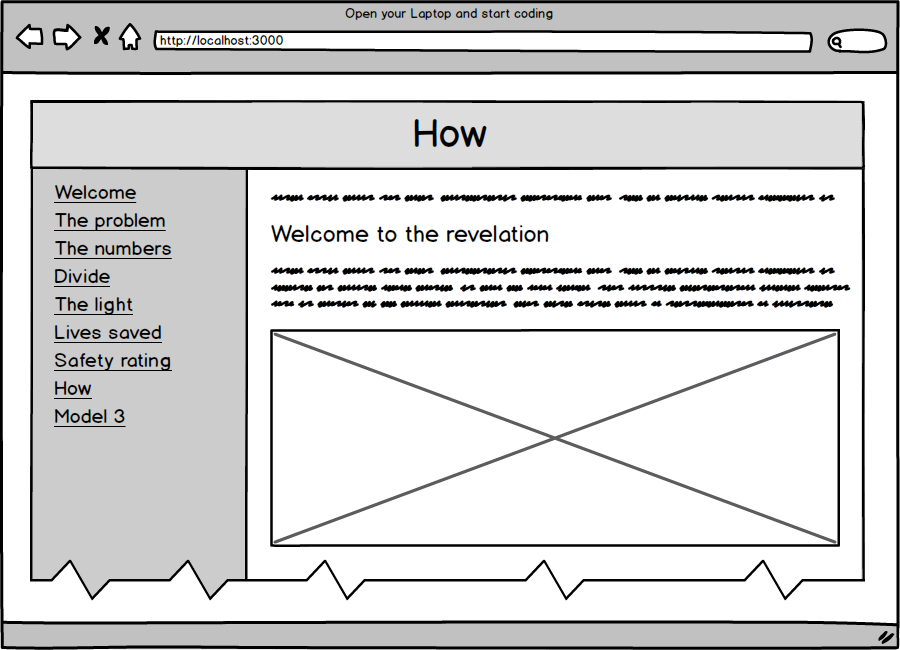
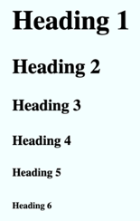

# Coding my first website

Our task is to create a very simple website, with the tools that we already have. All we have to do is to open our computer, be it a laptop or a PC. Just power it on and open ***Notepad*** on Windows or ***TextEdit*** on Mac or ***Gedit*** on Linux.

Here is a quick preview of the structure of the website. It is not a design, it is not the final version, it’s just a simple drawing with the intention to show you a better picture of what we are required to do, where the elements sit on the web page and so on.

## _Day 1_
### **Story #1**

* Create a new HTML page named `welcome.html`
* Create a layout with one horizontal row and two vertical columns like in the picture above. 
* The horizontal row will hold the title of the page
* The left column will hold the navigation menu
* The right column will hold the content of each page. 
* The content should be unique on any page, as well as the title and description of that content. The horizontal row must have a background of `#3b5998` while the title in it the colour of `white`. The title should not be taller than it needs to be.
* The group of the two vertical columns should be as wide as the webpage is and as tall as the webpage is. 
* This width of the first column should be 250px and the background colour of it should be `#8b9dc3`.
* The width of the second column should be the remaining available width and it should have a gap of 15px between the outer edge of the column and the content, between the border of the column and the content. The background colour should be `#dfe3ee`. 
* Both columns should have their contents starting at the top and not in the middle or bottom.
* Add a title to the page with the content of: `Welcome`. The same content should be present in the tab of the browser. The title should also be centred.
* Add after the title the content `Tesla saved more than 3255 lives and, with more than 531368 electric cars on the road, saves 2437 more lives each year, or 7 more every day`. The same content should be in the meta description of the page that serves as an indicator to search engines like Google.
* Add a subtitle with the content of `Welcome to the revelation`
* Add content with the content of `Tesla is saving lives for sure. I'm REPLACE_THIS_WITH_YOUR_NAME and here is a picture of the founder of CodeTap`
* Add the image `marian-zburlea.jpg`
* The picture should be as wide as possible on small or large screens
* There should be no gap between the layout and the window of the browser.

### **Story #2**
* Create a new web page named `the-problem.html` that has the same structure as the previous one
* The title of it should be `The problem`
* Add a description of `Every year, toxic air pollution causes about 5,500,000 early deaths worldwide, 40,000 in the UK, 9,000 in London.`
* Add six titles headers like in the picture below:


* Add the image `the-problem.jpg`
* Create a list of links in the first column of the layout so we can navigate between the two pages we’ve just created. The label of the links should be the title of each page while the helper text should be the description of the page it points to.

## _Day 2_
### **Story #3**

* Create a new web page named `the-numbers.html` that has the same structure as the previous one
* The title of it should be `The numbers`
* Add a description of 
  * `There are more than 1.2 billion cars worldwide` with the background of `tomato`
  * `that produce toxic air pollution,` with the background of `orange`
  * `which cause 5,500,000 deaths` with the background of `dodgerblue`
  * `all around the world.` with the background of `mediumseagreen`
* Add the image `the-numbers.jpg`
* Update the list of links in the first column of the layout so we can navigate between all the pages we’ve just created.

### **Story #4**
* Create a new web page named `divide.html` that has the same structure as the previous one
* The title of it should be `Divide`
* Add a description of `Divide the number of cars to the total deaths number to get that each group of 218 gasoline drivers are responsible for the early death of one of their own.`
* Add the image `divide.jpg`
* Update the list of links in the first column of the layout so we can navigate between all the pages we’ve just created.

## _Day 3_
### **Story #5**
* Create a new web page named `the-light.html` that has the same structure as the previous one
* The title of it should be `The light`
* Add a description of `By driving an electric car like Tesla, each 218 EV owners negate that number and save a life each year.`
* Add the image `the-light.jpg`
* Update the list of links in the first column of the layout so we can navigate between all the pages we’ve just created.

### **Story #6**
* Create a new web page named `lives-saved.html` that has the same structure as the previous one
* The title of it should be `Lives saved`
* Add the following table

| Year | Model | Sales | Lives | Total lives saved per model |
|------|:-----:|------:|------:|----------------------------:|
| 2012 | S | 2650 | 60 | 2026 |
| 2013 |   | 22442 | 412 |  |
| 2014 |   | 31655 | 435 |  |
| 2015 |   | 50446 | 462 |  |
| 2016 |   | 50931 | 174 |  |
| 2017 |   | 54715 | 251 |  |
| 2018 |   | 50630 | 232 |  |
| 2015 | X | 212 | 2 | 554 |
| 2016 |   | 25312 | 116 |  |
| 2017 |   | 46535 | 213 |  |
| 2018 |   | 48680 | 223 |  |
| 2017 | 3 | 1550 | 7 | 675 |
| 2018 |   | 145610 | 668 |  |

* Add the image `lives-saved.jpg`
* Update the list of links in the first column of the layout so we can navigate between all the pages we’ve just created.

### **Story #7**
* Create a new web page named `safety-rating.html` that has the same structure as the previous one
* The title of it should be `Safety rating`
* Add a description of `Tesla Model S Achieves Best Safety Rating of Any Car Ever Tested. This and the autopilot make Tesla save more lives every day.`
* Add the image `safety-rating.jpg`
* Update the list of links in the first column of the layout so we can navigate between all the pages we’ve just created.

### **Story #8**
* Create a new web page named `how.html` that has the same structure as the previous one
* The title of it should be `How`
* Add a description of `Buy a Model S, Model X, Model 3 or Model Y today! Be S3Xy! Any other EV alternative would do just fine.`
* Add the image `how.jpg`
* Update the list of links in the first column of the layout so we can navigate between all the pages we’ve just created.

### **Story #9**
* Create a new web page named `model-3.html` that has the same structure as the previous one
* The title of it should be `Model 3`
* Add a description of `When the 400,000 preorders will be delivered, those Model 3 alone will save 1834 lives each year!`
* Add the image `model-3.jpg`
* Update the list of links in the first column of the layout so we can navigate between all the pages we’ve just created.

### **Story #10**
* Create a new web page named `save-a-life.html` that has the same structure as the previous one
* The title of it should be `Save a life`
* Add a description of `It's OK. If you still can't touch. You can save us spreading the Be a hero! Save a life today!`
* Add the image `save-a-life.jpg`
* Update the list of links in the first column of the layout so we can navigate between all the pages we’ve just created.

### **Story #11**
* Create a new web page named `about.html` that has the same structure as the previous one
* The title of it should be `About`
* Add a description of `This website is built using only CSS3 and HTML5. That's right, no JavaScript.`
* Add the link with the label `Github project` and the link pointing to `https://github.com/marianzburlea/tesla-saves-lives`
* Add the link with the label `Data sources` and the link pointing to https://github.com/marianzburlea/tesla-saves-lives/blob/master/SOURCES.md
* Visit https://youtu.be/Y6Gz1ceMDNE, click the Share button and grab the embed code and implement it in the website after the two links. Make the video responsive to the entire width of the website.
* Update the list of links in the first column of the layout so we can navigate between all the pages we’ve just created.
